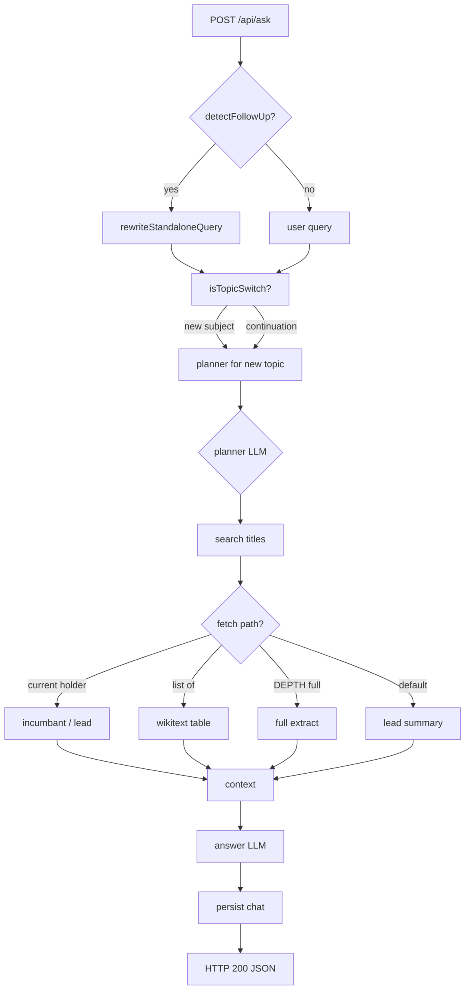
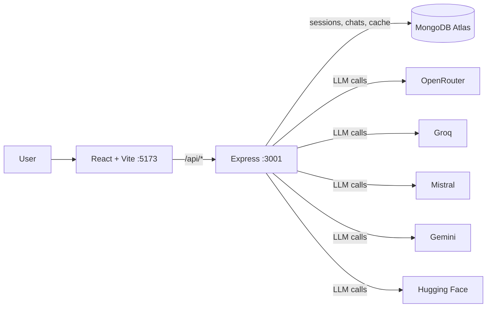
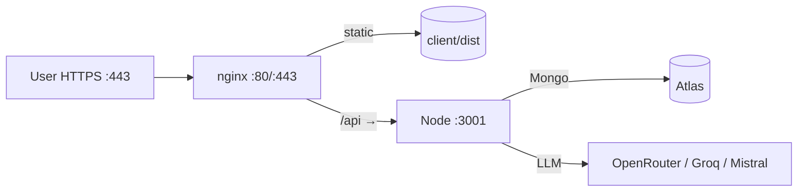

# Wikipedia Agent

One truth source. Many free-tier brains.

[](https://github.com/Bruh-Ryan/small-agent-project/actions/workflows/node.yml)
[](https://github.com/Bruh-Ryan/small-agent-project/actions/workflows/java.yml)
[](https://github.com/Bruh-Ryan/small-agent-project/actions/workflows/secret-scan.yml)


---

## What it is

Wikipedia Agent is a **simple advanced knowledge machine**. It answers questions by grounding every fact in **one truth source: Wikipedia**. Instead of a single LLM hallucinating, it plans a lookup, fetches Wikipedia pages through four specialized paths, and synthesizes the answer — only citing what the source actually says.

The model layer runs on **multiple free-tier providers** (OpenRouter, Groq, Mistral) with **automatic, any-error fallback**. When one provider hits its quota, the chain keeps going. The user sees an answer, not a rate-limit error.

---

## Features

- **Any-error fallback chain** — 402/429/5xx, network, malformed, empty reasoning, **and 400/401/404** all trigger the next provider. One broken provider never fails the user.
- **Flash-first free models** — the smallest, fastest model from each provider leads the chain so the first attempt is cheap and fast.
- **Conversation-aware** — follow-ups rewrite to standalone questions; `isTopicSwitch` detects subject changes (celebrity → JVM architecture) and plans for the new subject without blending.
- **Transparent plan panel** — shows which models were tried, which fell back, and the rescuing model.
- **Recency-aware** — "current/latest" queries force a 24h cache max-age and refetch live.
- **AI titles from the answer** — zero extra LLM calls; the title is extracted from the answer stream.
- **Auth + history** — bcrypt accounts, 15-chat cap per user, MongoDB sessions with `wiki.sid` cookie.
- **Wikipedia cache with TTL** — lead/summary 7d, incumbent 24h; MediaWiki rate-limit backoff built in.
- **Any provider failure surfaces as a friendly bubble** — all fail → HTTP 200, `allFailed: true`, readable message with what to try next.

---

## How it works



---

## Fallback chain

```
selected model
→ one free model per OTHER configured provider (spread)
→ leftovers from those providers (free first)
→ same provider's remaining free models
→ capped at MAX_FALLBACKS = 2
```

Any provider failure → next model. This includes 402, 429, 5xx, network, malformed, empty reasoning, **400, 401, 404**. When every model fails: HTTP 200 with `model: null`, `allFailed: true`, `requestedModel`, `failures[]`, and a friendly bubble the user can read.

**Curated models (16 total, flash-first per provider):**

| Provider | Models (flash-first) | Free tier |
|---|---|---|
| OpenRouter | `openai/gpt-4o`, `openai/gpt-4o-mini`, `anthropic/claude-sonnet-5`, `google/gemini-2.5-flash`, `meta-llama/llama-3.3-70b-instruct`, `deepseek/deepseek-chat-v3-0324`, `qwen/qwen3.8-27b:free`, `google/gemma-4-31b-it:free`, `nvidia/nemotron-3-super-120b-a12b:free`, `nvidia/nemotron-3.5-lightning:free` | 4 `:free` models |
| Groq | `qwen/qwen3.8-27b` (flash), `openai/gpt-oss-20b`, `openai/gpt-oss-120b` | All free |
| Mistral | `ministral-8b-latest` (flash), `mistral-small-latest`, `mistral-medium-latest` | Free Experiment tier |
| Gemini | `gemini-2.5-flash`, `gemini-2.5-flash-lite` | Free Flash tier (key needed) |
| Hugging Face | `deepseek-ai/DeepSeek-V3-0324`, `Qwen/Qwen3-235B-A22B` | Inference Providers (~$0.10/mo free) |

Only providers with a key in `.env` appear in the picker. Set `MODEL=groq:openai/gpt-oss-120b` (or any catalog id) to override the default.

---

## Architecture & stack



| Layer | Technology |
|---|---|
| Frontend | React 18, Vite 5 |
| Backend | Express 4, ESM |
| Database | MongoDB Atlas (sessions, chats, wiki_cache) |
| LLM Providers | OpenRouter, Groq, Mistral, Gemini, Hugging Face |
| Testing | Vitest (137 tests, all mocked, 0 API quota) |
| CI | GitHub Actions: Node CI, Java CI, Secret scan |

---

## Quickstart

```bash
git clone https://github.com/Bruh-Ryan/small-agent-project.git
cd small-agent-project
cp .env.example .env
# edit .env: fill OPENROUTER_API_KEY, GROQ_API_KEY, MISTRAL_API_KEY, MONGODB_URI, SESSION_SECRET
npm install
npm run dev          # starts server :3001 and client :5173 (concurrently)
```

Open `http://localhost:5173`. Register, then ask anything.

```bash
npm test             # 137 tests, ~3s, 0 API quota
npm --prefix client run build   # production build
```

---

## Configuration

| Variable | Purpose |
|---|---|
| `OPENROUTER_API_KEY` | OpenRouter key (required for catalog) |
| `GROQ_API_KEY` | Groq key (free tier) |
| `MISTRAL_API_KEY` | Mistral key (free Experiment tier) |
| `GEMINI_API_KEY` | Gemini key (free Flash tier) |
| `HF_TOKEN` | Hugging Face token (Inference Providers) |
| `MONGODB_URI` | Atlas connection string |
| `SESSION_SECRET` | express-session signing secret (random if missing) |
| `MODEL` | default model id (e.g. `groq:openai/gpt-oss-120b`); blank = first enabled |
| `FORCE_FAIL_PROVIDERS` | **test-only**: comma list of provider names / model ids / `all` to force failures without waiting for quota |

---

## Testing & CI

- **137 tests**, all mocked (0 live API calls, 0 quota).
- **Node CI** (`.github/workflows/node.yml`): `npm test` + client build on every push/PR.
- **Java CI** (`.github/workflows/java.yml`): legacy agent compile + unit tests only (no live call).
- **Secret scan** (`.github/workflows/secret-scan.yml`): gitleaks over the working tree on every push — scans checked-out files only, not history, so the rotated OpenRouter key in `3e2921f` never re-fails the badge.

---

## Deploy to AWS (free tier)

### Why EC2 free tier?

- **Stateless server** — sessions and cache live in Atlas; no EBS/EFS needed.
- **Single origin keeps cookies simple** — the client uses relative `/api` paths, so the API and the React build share the same origin. No CORS/cookie surgery needed (`SameSite=lax` works).
- **Free tier**: `t4g.micro` (ARM) or `t2.micro` (x86) gives 750 hrs/mo for 12 months.
- Cost after free tier: ~$7–10/mo (on-demand) or ~$1.5/mo with a 1-yr Savings Plan.

### Architecture



### Cost table

| Item | Free tier | After free tier (on-demand) |
|---|---|---|
| EC2 `t4g.micro` (ARM) | 750 hrs/mo × 12 mo | ~$0.0084/hr ≈ $6.13/mo |
| Data egress | 100 GB/mo | $0.09/GB |
| MongoDB Atlas M0 | 512 MB free | $0 |
| LLM providers | Free tiers | As per provider |

**Estimated after free tier: ~$7–10/mo** (EC2 + modest egress).

---

### Pre-deploy code changes (required before building the image)

The current code runs on `http://localhost` with `secure: false` and no `trust proxy`. Behind nginx/HTTPS you **must** change:

1. **Express trust proxy** — in `server/src/index.js` add early:

```js
app.set("trust proxy", 1);
```

2. **Session cookie env-driven** — in `server/src/middleware/session.js`:

```js
cookie: {
  httpOnly: true,
  sameSite: "lax",
  secure: process.env.NODE_ENV === "production",
  maxAge: 14 * 24 * 60 * 60 * 1000,
},
```

3. **Keep client relative BASE** — `VITE_API_URL` stays unset so the client uses `/api/...` relative paths. The client and API share the same origin (nginx serves the React build and proxies `/api` to Node). No CORS changes needed.

4. **Never bake `.env` into the image** — copy `.env` to the instance via `scp`, `chmod 600`, and pass `--env-file .env` to `docker run` (or use a compose file with `env_file: .env`).

5. **Nginx timeout for long LLM calls** — in the `/api` proxy block:

```nginx
proxy_read_timeout 120s;
proxy_send_timeout 120s;
```

---

### Step-by-step (one-time setup)

1. **Launch instance**  
   - Ubuntu 22.04/24.04 LTS, `t4g.micro` (ARM) or `t2.micro` (x86).  
   - Key pair for SSH.  
   - Security group: inbound 22 (your IP), 80, 443.

2. **Install Docker + Nginx + Certbot**

```bash
sudo apt update && sudo apt install -y docker.io nginx certbot python3-certbot-nginx
sudo usermod -aG docker $USER
newgrp docker
```

3. **Transfer repo + secrets**

```bash
# On your machine
scp -i key.pem -r . ubuntu@<ip>:/home/ubuntu/wiki-agent
scp -i key.pem .env ubuntu@<ip>:/home/ubuntu/wiki-agent/.env
ssh -i key.pem ubuntu@<ip> "chmod 600 /home/ubuntu/wiki-agent/.env"
```

4. **Dockerfile (multi-stage) — create on the instance or add to repo later**

```dockerfile
# ---- build client ----
FROM node:24-alpine AS client-builder
WORKDIR /app/client
COPY client/package*.json ./
RUN npm ci
COPY client/ ./
RUN npm run build

# ---- build server ----
FROM node:24-alpine AS server-builder
WORKDIR /app/server
COPY server/package*.json ./
RUN npm ci --omit=dev
COPY server/ ./

# ---- runtime ----
FROM node:24-alpine
WORKDIR /app
COPY --from=server-builder /app/server ./server
COPY --from=client-builder /app/client/dist ./server/public
WORKDIR /app/server
ENV NODE_ENV=production
EXPOSE 3001
CMD ["node", "src/index.js"]
```

```bash
# on the instance
cd /home/ubuntu/wiki-agent
docker build -t wiki-agent .
docker run -d --name wiki-agent \
  --env-file .env \
  -p 3001:3001 \
  --restart unless-stopped \
  wiki-agent
```

5. **Nginx site** `/etc/nginx/sites-available/wiki-agent`

```nginx
server {
    listen 80;
    server_name your.domain;   # or just _ for IP

    root /home/ubuntu/wiki-agent/server/public;
    index index.html;

    location / {
        try_files $uri $uri/ /index.html;
    }

    location /api/ {
        proxy_pass http://localhost:3001;
        proxy_http_version 1.1;
        proxy_set_header Upgrade $http_upgrade;
        proxy_set_header Connection "upgrade";
        proxy_set_header Host $host;
        proxy_set_header X-Real-IP $remote_addr;
        proxy_set_header X-Forwarded-For $proxy_add_x_forwarded_for;
        proxy_set_header X-Forwarded-Proto $scheme;
        proxy_read_timeout 120s;
        proxy_send_timeout 120s;
    }
}
```

```bash
sudo ln -s /etc/nginx/sites-available/wiki-agent /etc/nginx/sites-enabled/
sudo nginx -t && sudo systemctl reload nginx
```

6. **HTTPS with Certbot**

```bash
sudo certbot --nginx -d your.domain
# Certbot auto-configures 443 + HSTS + redirect 80→443
```

7. **Atlas Network Access**  
   In Atlas → Network Access → Add IP Address → the instance's public IP (or `0.0.0.0/0` with strong creds + `SESSION_SECRET` rotation).

8. **Verify**

```bash
curl https://your.domain/api/health   # {"ok":true}
# open https://your.domain in browser
```

### Update flow

```bash
ssh -i key.pem ubuntu@<ip>
cd /home/ubuntu/wiki-agent
git pull
docker build -t wiki-agent .
docker stop wiki-agent && docker rm wiki-agent
docker run -d --name wiki-agent --env-file .env -p 3001:3001 --restart unless-stopped wiki-agent
```

### Security checklist

- `.env` **never** in the image or git — `scp` + `chmod 600`.
- Rotate the leaked OpenRouter key (see Security note below).
- `SESSION_SECRET` set in `.env` (not the random fallback).
- Security group: 22/80/443 only; 22 restricted to your IP.
- Secret scan runs on every push.
- Atlas IP allowlist restricted to the instance IP.

---

## Roadmap

- **LLM council for coding tasks** — multiple free-tier LLMs collaborate on a coding request, each playing a role (architect, implementer, reviewer, tester).
- **Per-model token tracking** — exact free-token consumption logged per provider so you know when a tier will reset.
- **Per-model context management** — each model in the council gets a tailored context window, summarized and routed to stay within its free window.
- **Gemini / Hugging Face keys** — add `GEMINI_API_KEY` / `HF_TOKEN` to `.env` for two more free pools.
- **Table parsing** — nested tables / rowspan support in `formatWikiTable`.
- **`list of` dispatch** — extend beyond `startsWith("list of")` to catch more table pages.

---

## Known limits

- `formatWikiTable` handles flat "List of ___" tables; nested tables / rowspans may mangle.
- "list of" dispatch is `startsWith("list of")` — other table pages miss it.
- Free-tier limits fluctuate wildly (OpenRouter prompt cap seen 7980 → 1302 in one night); fallback chain keeps the app alive.
- MediaWiki `exchars` silently capped at ~1200 — slice extracts yourself for larger needs.
- Cache TTL: lead 7d, incumbent 24h — "current/latest" queries force 24h max-age.

---

## Repo layout

```
small-agent-project/
├── .github/workflows/     # node.yml, java.yml, secret-scan.yml
├── .gitleaks.toml         # secret scan allowlist
├── server/
│   ├── src/
│   │   ├── agent/         # planner, answer, searchBar, llm, providers, models
│   │   ├── wikipedia/     # http, search, summary, wikitext, incumbent, cache
│   │   ├── models/        # Chat, User, WikiCache
│   │   ├── middleware/    # session, auth
│   │   ├── routes/        # ask, sessions, models, auth
│   │   ├── index.js
│   │   └── config.js
│   ├── test/              # 137 Vitest tests
│   ├── scripts/           # llm-smoke, llm-fallback-proof, phase7-e2e, list-*
│   ├── vitest.config.js
│   └── package.json
├── client/
│   ├── src/
│   │   ├── components/    # SessionSidebar, ChatWindow, MessageBubble, PlanPanel, Composer, LoginPage
│   │   ├── App.jsx, api.js, main.jsx
│   │   └── index.css, App.css
│   ├── vite.config.js
│   └── package.json
├── .env.example
├── progress.md
├── AGENTS.md
└── README.md              # (this file)
```

---

## Security note

Commit `3e2921f` ("first comit") committed a real `OPENROUTER_API_KEY` at `.env/.env` to the public history of this repo. The key was **rotated on 2026-09-27**; deleting the file (`16c6eed`) does not remove it from existing clones — rotation is the fix. Groq, Mistral, `SESSION_SECRET`, and `MONGODB_URI` were never committed. The Mongo URI strings in `progress.md` and `db.js` are placeholders.

The secret scan CI runs gitleaks on the **checked-out files only** so it never re-fails on the historical leak. If it ever fires: revoke the credential first, then fix the file — do not widen the allowlist to get a green badge.

---

## License

This project is unlicensed (public domain). Use, modify, and share freely.